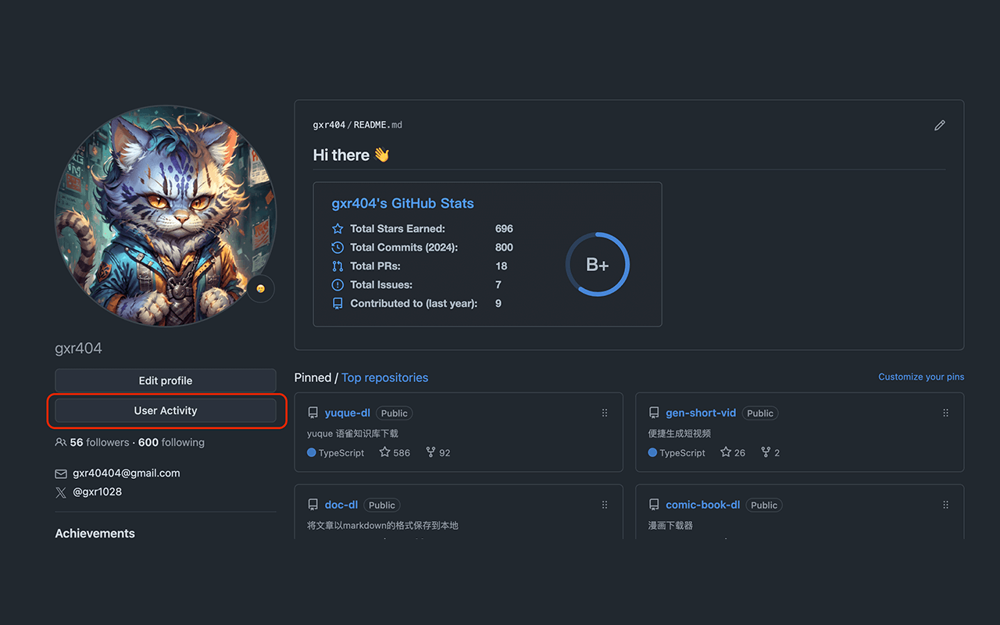
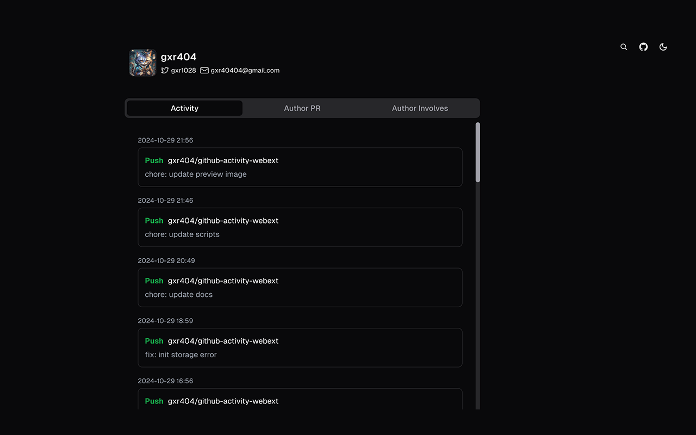
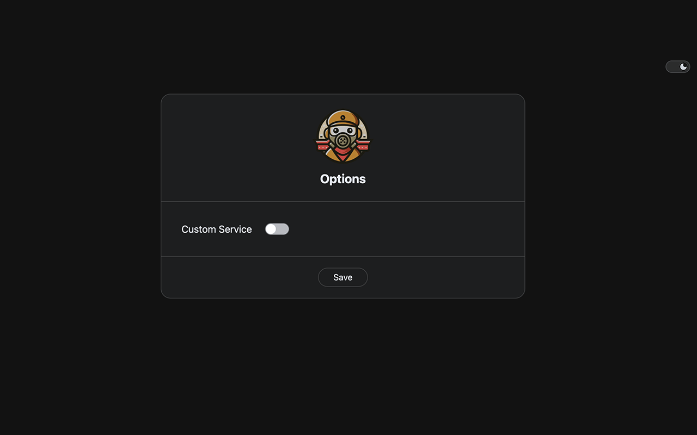

# github-activity-webext

English | [中文](./README_CN.md)

A browser plug-in that adds a user activity button to the github user page to jump to the user activity information page (provided by the [github-activity](https://github.com/gxr404/github-activity) project)

## Install

- Chrome Web Store
- Local

## Preview

## suggestion

[Since GitHub API has a usage limit](https://docs.github.com/zh/rest/using-the-rest-api/rate-limits-for-the-rest-api?apiVersion=2022-11-28), it is recommended to use self-deployed services.

Right-click the browser plug-in option, jump to the options page, and fill in the domain name of the self-deployed service

PS: [Self-deployment github-activity](https://github.com/gxr404/github-activity#deploy-on-vercel)
