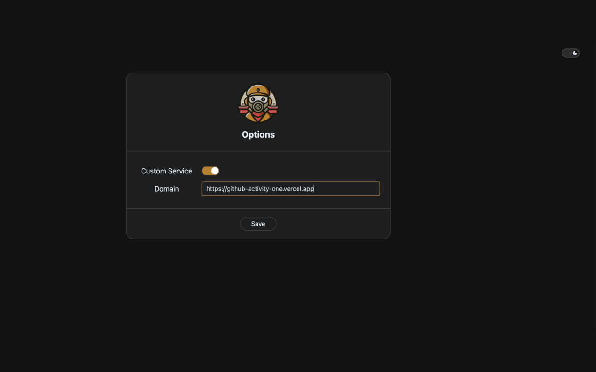

# github-activity-webext

[English](./README.md) | 中文

一个浏览器插件，给github用户页添加`user activity`按钮
跳转至 用户活跃信息页(由 [github-activity](https://github.com/gxr404/github-activity) 项目提供)

## 安装

- [Chrome Web Store](https://chromewebstore.google.com/detail/github-activity/oniblhabpoedbigijdfkmogeieamlbkk?authuser=0&hl=zh-CN)
- [Local](https://github.com/gxr404/github-activity-webext/releases)

## 预览

## 建议

[由于github api有使用额度限制](https://docs.github.com/zh/rest/using-the-rest-api/rate-limits-for-the-rest-api?apiVersion=2022-11-28)，建议使用自部署的服务

浏览器插件右击选项，跳转至选项页, 填入自部署服务的域名

PS: [自部署github-activity查看](https://github.com/gxr404/github-activity#deploy-on-vercel)
